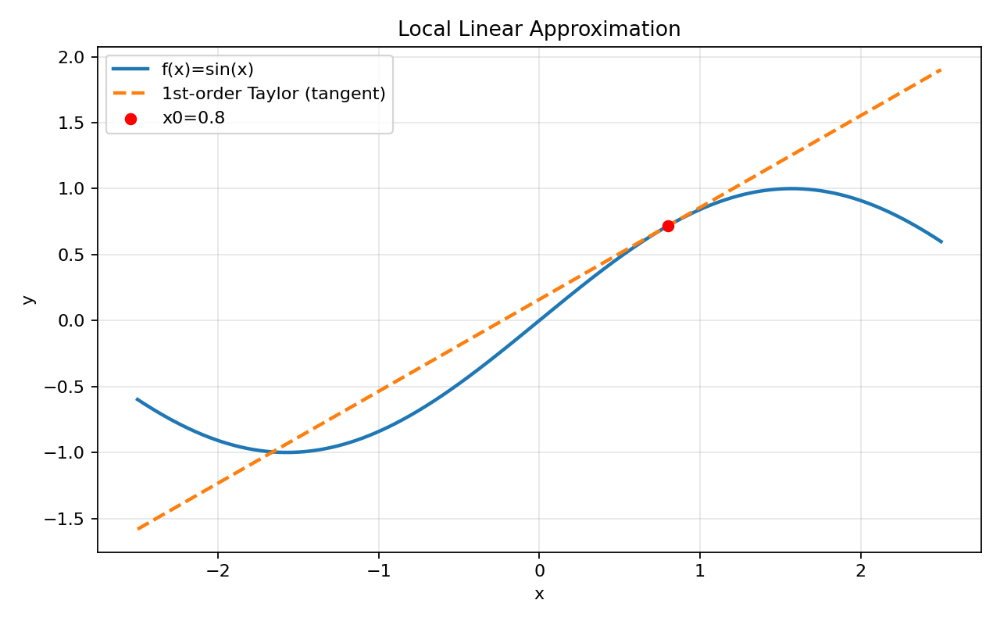
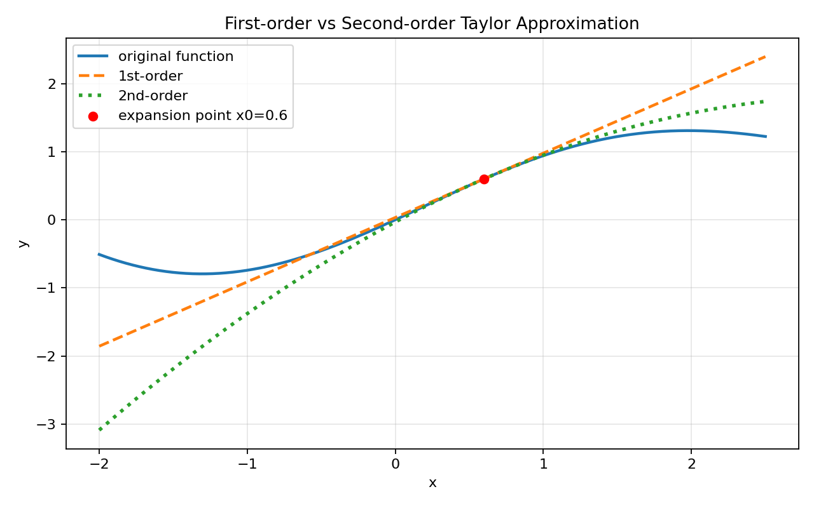
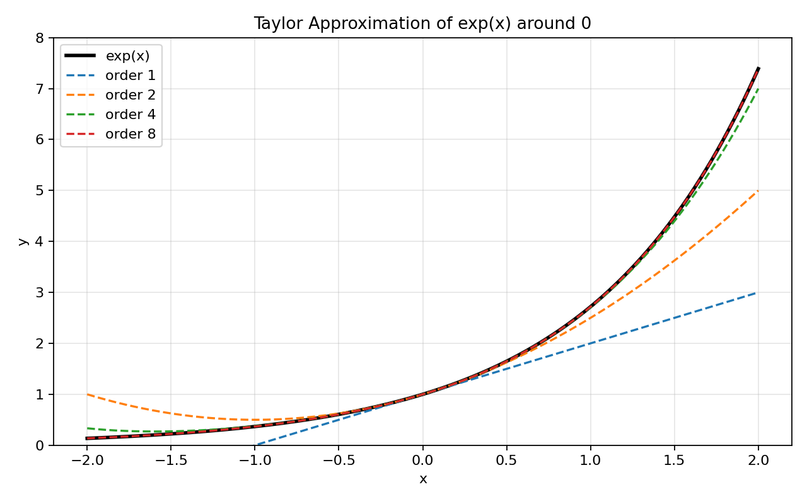

# 01. 泰勒展开是什么（先修专题）

> 本节目标：不追求复杂证明，先把“泰勒展开到底在干什么”讲清楚。
> 配套可视化：`01_泰勒展开是什么_可视化.ipynb`

## 1) 一句话理解

**泰勒展开 = 用你在某个点已知的信息（函数值、导数、二阶导...），去近似函数在附近的值。**

你可以把它理解成：
- 在一个点附近，原函数太复杂；
- 我们用“更简单的多项式”临时替代它。

---

## 2) 为什么要学它？

因为在机器学习中，我们经常面对复杂损失函数，直接分析很难。泰勒展开可以告诉我们：

1. 在当前位置附近，函数大概怎么变；
2. 梯度下降为什么通常能下降；
3. 学习率太大时为什么容易失效（局部近似不准）。

---

## 3) 从“切线近似”开始（最核心直觉）

对于一元函数 $f(x)$，在点 $x_0$ 附近：

$$
f(x) \approx f(x_0) + f'(x_0)(x-x_0)
$$

这就是一阶泰勒展开（线性近似）。

含义：
- $f(x_0)$ 是“基准高度”；
- $f'(x_0)$ 是“局部斜率”；
- $(x-x_0)$ 是“你离基准点走了多远”。

---

## 4) 加入弯曲信息（二阶）

$$
f(x) \approx f(x_0)+f'(x_0)(x-x_0)+\frac12 f''(x_0)(x-x_0)^2
$$

二阶项体现“弯曲程度”。

- 一阶：只看斜率（像直线）
- 二阶：再考虑弯曲（像抛物线）

通常二阶在更大一点的邻域会更准。

---

## 5) 一般形式（了解即可）

在 $x_0$ 处的 $n$ 阶泰勒多项式：

$$
f(x)\approx \sum_{k=0}^{n}\frac{f^{(k)}(x_0)}{k!}(x-x_0)^k
$$

当 $n$ 越大，且函数足够光滑时，近似通常越好（在一定范围内）。

---

## 6) 一个经典例子：$e^x$ 在 0 点展开

由于 $e^x$ 的各阶导数都还是 $e^x$，在 0 点都等于 1：

$$
e^x \approx 1 + x + \frac{x^2}{2!} + \frac{x^3}{3!}+\cdots
$$

这就是为什么很多计算里会用多项式近似指数函数。

---

## 7) 图表化理解（运行 notebook 生成）

### 图1：函数与切线（局部线性近似）

### 图2：一阶 vs 二阶近似对比

### 图3：$e^x$ 的多阶近似

---

## 8) 常见误区

1. 以为泰勒展开在全局都准确（错，它主要是局部近似）。
2. 以为阶数越高就一定更好（数值范围和函数性质也重要）。
3. 只背公式，不看几何意义（切线、曲率）。

---

## 9) 本节可复述版

- 泰勒展开是用某点处的导数信息构造多项式来近似原函数。
- 一阶泰勒是切线近似，二阶泰勒加入曲率信息。
- 在机器学习里，它帮助理解梯度下降和学习率选择。
