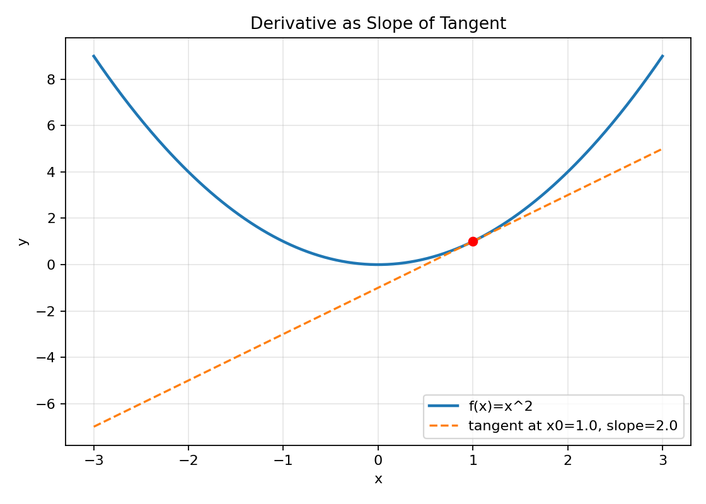
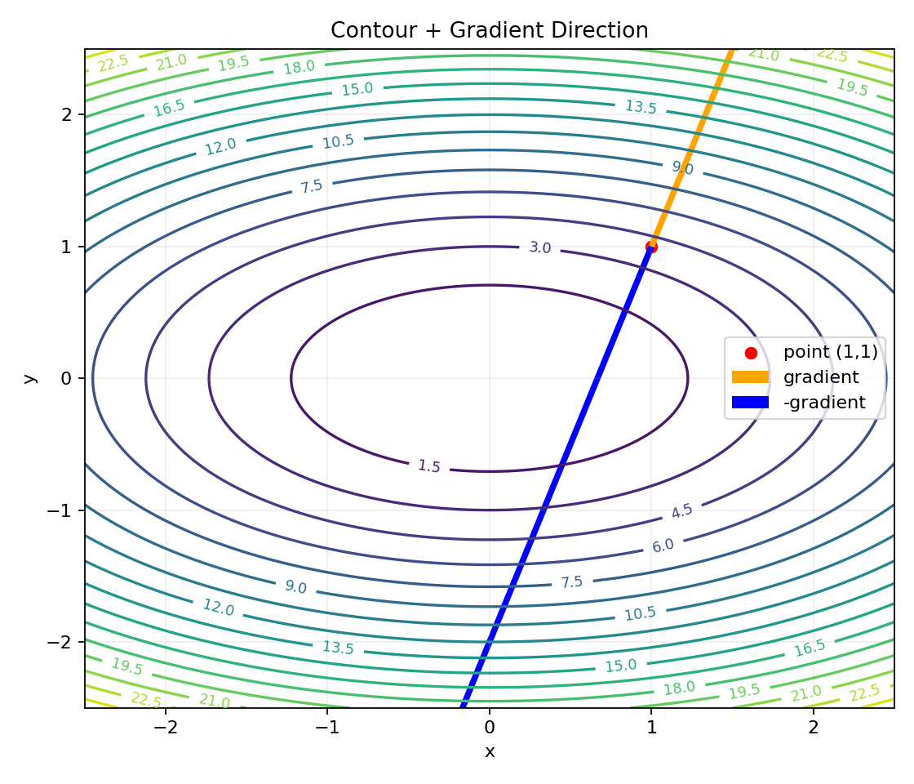
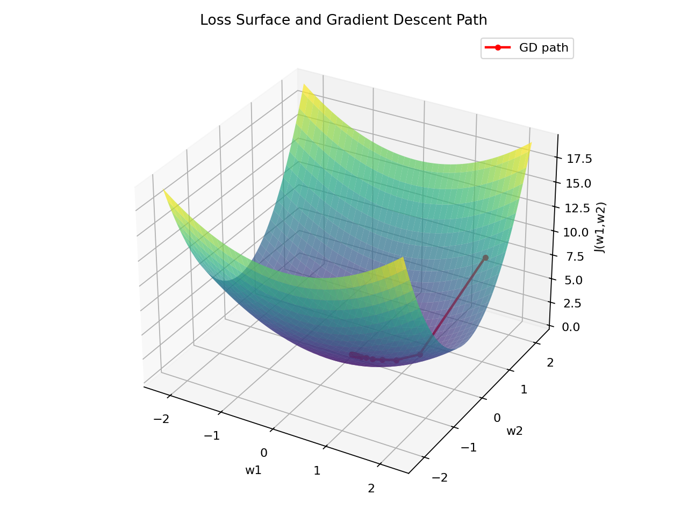

# 01. 导数、偏导、梯度

> 如果你看不到公式渲染（只看到 `\[` `\]` 或 `$` 符号），通常是 **Markdown 阅读器不支持数学公式**。
> 推荐：使用 VS Code + `Markdown Preview Enhanced` 插件，或 Typora / Obsidian。
> 在 VS Code 中按 `Ctrl+Shift+V` 打开预览。

## 1) 直觉理解

- **导数**：一元函数在某点“变化有多快”（斜率）。
- **偏导**：多元函数中“只改变一个变量，其他变量固定”时的变化率。
- **梯度**：把所有偏导组成一个向量，表示函数增长最快方向。

可以把损失函数想象成山地地形：
- 梯度方向是“最陡上坡方向”；
- 负梯度方向是“最陡下坡方向”（训练时参数更新常走这个方向）。

---

## 2) 数学定义

### 2.1 导数（一元）

设 $f(x)$ 在 $x$ 处可导，则

$$
f'(x)=\lim_{h\to 0}\frac{f(x+h)-f(x)}{h}
$$

表示切线斜率（局部线性变化率）。

### 2.2 偏导（多元）

设 $f(x_1,\dots,x_n)$，对 $x_i$ 的偏导：

$$
\frac{\partial f}{\partial x_i}=
\lim_{h\to 0}
\frac{f(x_1,\dots,x_i+h,\dots,x_n)-f(x_1,\dots,x_i,\dots,x_n)}{h}
$$

### 2.3 梯度

$$
\nabla f(\mathbf{x})=
\begin{bmatrix}
\frac{\partial f}{\partial x_1}\\
\vdots\\
\frac{\partial f}{\partial x_n}
\end{bmatrix}
$$

> 讨论补充：梯度是**某一个点处**的局部量，不是“全局唯一向量”。

---

## 3) 机器学习中的作用

### 3.1 参数更新

对于损失函数 $J(\mathbf{w})$，梯度下降：

$$
\mathbf{w}_{t+1}=\mathbf{w}_t-\eta\nabla J(\mathbf{w}_t)
$$

- $\eta$：学习率。
- 含义：每一步朝“损失下降最快方向”移动一点。

### 3.2 为什么是负梯度？

梯度是增长最快方向；我们要最小化损失，所以取反方向。

> 讨论补充：参数更新应沿 **负梯度** 前进，而不是沿梯度前进。

---

## 4) 小例子

设

$$
f(x,y)=x^2+3y^2
$$

则

$$
\frac{\partial f}{\partial x}=2x,
\quad
\frac{\partial f}{\partial y}=6y
$$

所以

$$
\nabla f(x,y)=
\begin{bmatrix}
2x\\
6y
\end{bmatrix}
$$

若当前点为 $(x,y)=(1,1)$，梯度是 $(2,6)$，
负梯度方向 $(-2,-6)$ 是更快下降方向。

### 4.1 继续：如何更新参数（梯度下降）

对本例 $f(x,y)=x^2+3y^2$，梯度下降更新为：

$$
\begin{aligned}
x_{t+1} &= x_t - \eta \frac{\partial f}{\partial x} = x_t-\eta(2x_t)=(1-2\eta)x_t \\
y_{t+1} &= y_t - \eta \frac{\partial f}{\partial y} = y_t-\eta(6y_t)=(1-6\eta)y_t
\end{aligned}
$$

若取学习率 $\eta=0.1$，从 $(x_0,y_0)=(1,1)$ 出发：

- 第1步：
  - 梯度 $\nabla f(1,1)=(2,6)$
  - 更新后 $(x_1,y_1)=(1,1)-0.1(2,6)=(0.8,0.4)$
  - 损失 $f(0.8,0.4)=0.8^2+3\cdot0.4^2=1.12$
- 第2步：
  - $(x_2,y_2)=((1-0.2)0.8,(1-0.6)0.4)=(0.64,0.16)$
  - $f(0.64,0.16)=0.4864$
- 第3步：
  - $(x_3,y_3)=(0.512,0.064)$
  - $f(0.512,0.064)=0.274432$

可以看到参数逐步接近 $(0,0)$，损失持续下降。

### 4.2 学习率补充（本例）

由

$$
x_{t+1}=(1-2\eta)x_t,\quad y_{t+1}=(1-6\eta)y_t
$$

要收敛需同时满足 $|1-2\eta|<1$ 与 $|1-6\eta|<1$，所以：

$$
0<\eta<\frac{1}{3}
$$

这也解释了：学习率过大时，可能震荡甚至发散。

---

## 5) 图表化理解建议

> 已提供可执行可视化文件：
> - Jupyter Notebook：`01_导数_偏导_梯度_可视化.ipynb`
> - 运行后会在 `./assets/` 下生成图像文件。

### 如何生成图像

1. 安装依赖：`pip install numpy matplotlib jupyter`
2. 打开并运行：`01_导数_偏导_梯度_可视化.ipynb`
3. 执行完成后，本节可直接查看下方图片（若未显示，先确认 `assets` 目录已生成）。

### 图1：一元函数导数（曲线+切线）
- 横轴：$x$，纵轴：$f(x)$
- 在某一点画切线，斜率即导数。

### 图2：二元函数等高线 + 梯度箭头（重点）
- 在等高线图上，梯度箭头总垂直等高线并指向上升最快。
- 负梯度箭头用于演示梯度下降路径。

### 图3：损失面 + 迭代轨迹
- 可用 3D 曲面展示 $J(w_1,w_2)$，叠加若干更新点。

### 讨论补充：判断题结论

1. 对于二元函数，某点梯度方向与该点等高线切线方向垂直（正确）。
2. 梯度下降是沿负梯度更新参数（正确），不是沿梯度本身。

---

## 6) 常见误区

1. 把“偏导数值”误认为“方向”，其实方向由梯度向量整体决定。
2. 忘记学习率影响：学习率过大可能震荡，过小收敛慢。
3. 不做维度检查：$\nabla J(\mathbf{w})$ 维度应与 $\mathbf{w}$ 一致。
4. 只记更新公式，不理解“负梯度=最速下降”。

---

## 7) 本节可复述版（面试/考试）

- 导数描述一元函数的局部变化率；偏导是多元函数对单个变量的变化率。
- 梯度是所有偏导组成的向量，指向函数增长最快方向。
- 机器学习训练中通过负梯度更新参数，实现损失最小化。
