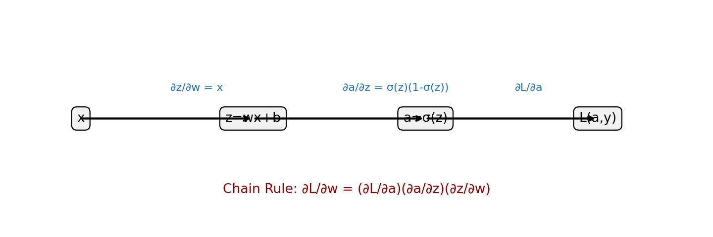
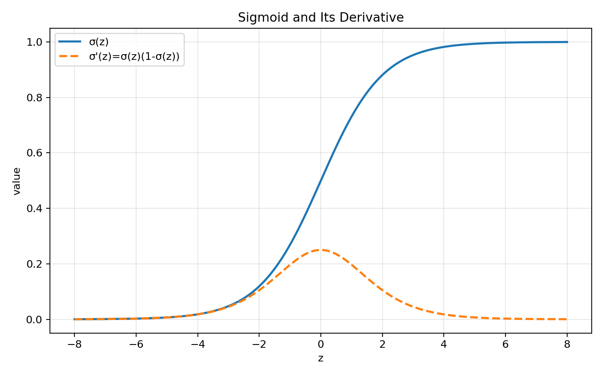
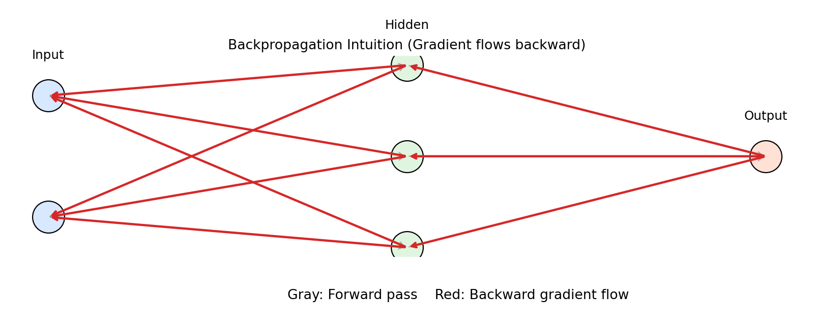

# 02. 链式法则与反向传播直觉

> 本节配套可视化文件：`02_链式法则与反向传播直觉_可视化.ipynb`
>
> 本节配套 PyTorch 逐步演示：`02_链式法则与反向传播直觉_PyTorch逐步演示.ipynb`
> （包含每一步数值打印：前向值、损失、梯度、参数更新前后对比）

## 1) 直觉理解

- 链式法则解决“复合函数怎么求导”。
- 神经网络就是很多层复合函数，因此训练本质是在做“层层传递梯度”。
- 反向传播（Backpropagation）就是高效应用链式法则：从输出层往输入层逐层算梯度。

一句话：**前向算输出，反向算梯度。**

---

## 2) 数学定义

### 2.1 一元链式法则

若 $y=f(u),\ u=g(x)$，则

$$
\frac{dy}{dx}=\frac{dy}{du}\cdot\frac{du}{dx}
$$

### 2.2 多元情形（常见于神经网络）

若 $z=f(x,y)$，且 $x=x(t),\ y=y(t)$，则

$$
\frac{dz}{dt}=\frac{\partial z}{\partial x}\frac{dx}{dt}+\frac{\partial z}{\partial y}\frac{dy}{dt}
$$

---

## 3) 在神经网络中的形式

单神经元：

$$
z = wx + b,\quad a=\sigma(z)
$$

损失设为 $L(a)$，则

$$
\frac{\partial L}{\partial w}
=
\frac{\partial L}{\partial a}
\cdot
\frac{\partial a}{\partial z}
\cdot
\frac{\partial z}{\partial w}
$$

其中：

- $\frac{\partial z}{\partial w}=x$
- 若 $a=\sigma(z)$，则 $\frac{\partial a}{\partial z}=\sigma(z)(1-\sigma(z))$

这就是“误差从后往前传”的核心。

---

## 4) 小例子（手算）

设

$$
L=(a-y)^2,\quad a=\sigma(z),\quad z=wx+b
$$

则

$$
\frac{\partial L}{\partial w}
=2(a-y)\cdot \sigma(z)(1-\sigma(z))\cdot x
$$

同理：

$$
\frac{\partial L}{\partial b}
=2(a-y)\cdot \sigma(z)(1-\sigma(z))
$$

### 4.1 数值手算例子（讨论补充）

设：

$$
x=2,\ w=0.5,\ b=0.1,\ y=1,\ \eta=0.1
$$

模型与损失：

$$
z=wx+b,\ a=\sigma(z),\ L=\frac12(a-y)^2
$$

前向：

$$
z=1.1,\ a\approx0.75026,\ L\approx0.03118
$$

反向（链式法则）：

$$
\frac{\partial L}{\partial a}=a-y\approx-0.24974,
\quad
\frac{\partial a}{\partial z}=a(1-a)\approx0.18737
$$

$$
\frac{\partial z}{\partial w}=x=2,
\quad
\frac{\partial z}{\partial b}=1
$$

所以：

$$
\frac{\partial L}{\partial w}
=
\frac{\partial L}{\partial a}
\frac{\partial a}{\partial z}
\frac{\partial z}{\partial w}
\approx-0.09357
$$

$$
\frac{\partial L}{\partial b}
=
\frac{\partial L}{\partial a}
\frac{\partial a}{\partial z}
\frac{\partial z}{\partial b}
\approx-0.04678
$$

参数更新（沿负梯度）：

$$
w' = w-\eta\frac{\partial L}{\partial w}\approx0.50936,
\quad
b' = b-\eta\frac{\partial L}{\partial b}\approx0.10468
$$

更新后损失约为：

$$
L'\approx0.03011<0.03118
$$

说明该步更新有效降低了损失。

---

### 4.2 讨论补充：概念判断结论

1. 反向传播就是由最终损失向前层参数（$W,b$）反向计算梯度（正确）。
2. 链式法则可理解为“参数微小变化对最终损失影响的逐层传递”（正确）。

### 4.3 训练循环伪代码（损失驱动参数更新）

> 严谨表述：不是“更新损失”，而是“更新参数，使下一轮损失更小”。

```text
输入: 数据集 D={(x_i,y_i)}, 初始参数 θ, 学习率 η, 迭代轮数 E

for epoch in 1..E:
    for batch B in D:
        # 1) 前向传播
        y_hat = model(B.x, θ)

        # 2) 计算批次损失
        L = loss(y_hat, B.y)

        # 3) 反向传播求梯度
        g = ∇_θ L

        # 4) 参数更新（梯度下降）
        θ = θ - η * g

输出: 训练后的参数 θ
```

若使用 mini-batch，通常对 batch 内损失取均值：

$$
L_B = \frac{1}{|B|}\sum_{(x,y)\in B}\ell(f(x;\theta), y)
$$

更新公式保持不变：

$$
\theta \leftarrow \theta - \eta\nabla_\theta L_B
$$

---

## 5) 图表化理解（运行 notebook 生成）

### 图1：复合函数链路图

显示 $x\to z\to a\to L$ 的依赖路径，并标注每段导数。



### 图2：Sigmoid 函数与导数

展示 $\sigma(z)$ 与 $\sigma'(z)=\sigma(z)(1-\sigma(z))$。



### 图3：两层网络梯度流示意

展示梯度从输出层向前层传播的箭头方向。



---

## 6) 常见误区

1. 只记结论，不沿计算图逐段求导。
2. 把“前向传播”和“反向传播”方向混淆。
3. 忘记激活函数导数，导致梯度公式缺项。
4. 不注意矩阵维度，实际实现时易报错。

---

## 7) 本节可复述版（面试/考试）

- 链式法则用于复合函数求导，神经网络训练依赖它计算参数梯度。
- 反向传播就是按计算图从后往前应用链式法则，高效得到每层参数梯度。
- 梯度计算正确性关键在于：路径完整、导数项齐全、维度一致。
