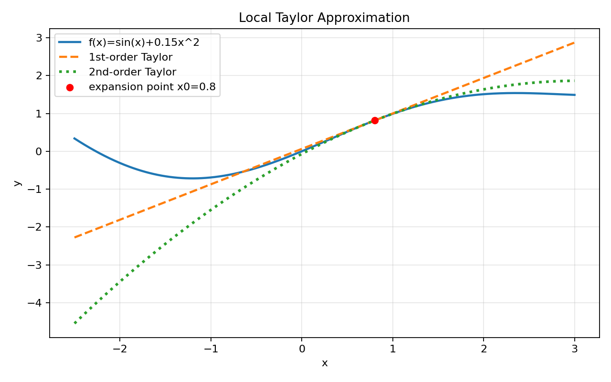
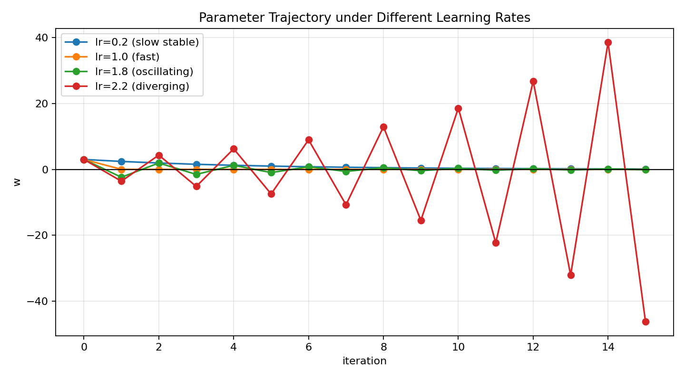
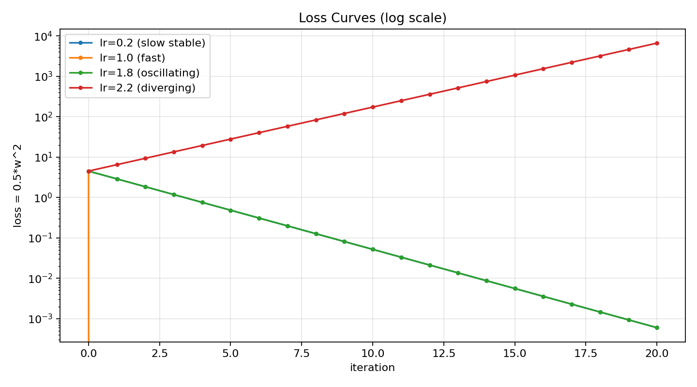

# 03. 泰勒展开与梯度下降收敛直觉

> 本节配套可视化文件：`03_泰勒展开与梯度下降收敛直觉_可视化.ipynb`

## 1) 直觉理解

- 泰勒展开的作用：在某个点附近，用多项式近似原函数。
- 梯度下降每次走一步，本质上是在用“局部近似”指导更新方向。
- 若学习率太大，局部近似失效，可能震荡或发散；适中则更容易收敛。

一句话：**梯度下降是“基于局部线性/二次近似”的逐步优化。**

---

## 2) 数学定义

### 2.1 一元泰勒展开（在 $x_0$ 处）

$$
f(x) \approx f(x_0) + f'(x_0)(x-x_0) + \frac{1}{2}f''(x_0)(x-x_0)^2
$$

若只保留一阶项，就是局部线性近似：

$$
f(x) \approx f(x_0) + f'(x_0)(x-x_0)
$$

### 2.2 多元情形（在 $\mathbf{w}$ 附近）

$$
J(\mathbf{w}+\Delta\mathbf{w})
\approx
J(\mathbf{w}) + \nabla J(\mathbf{w})^T\Delta\mathbf{w}
+ \frac12 \Delta\mathbf{w}^T H(\mathbf{w})\Delta\mathbf{w}
$$

其中 $H(\mathbf{w})$ 为 Hessian 矩阵。

---

## 3) 与梯度下降的关系

梯度下降更新：

$$
\mathbf{w}_{t+1}=\mathbf{w}_t-\eta\nabla J(\mathbf{w}_t)
$$

令 $\Delta\mathbf{w}=-\eta\nabla J(\mathbf{w})$，带入一阶近似：

$$
J(\mathbf{w}+\Delta\mathbf{w})
\approx
J(\mathbf{w})
-\eta\|\nabla J(\mathbf{w})\|^2
$$

只要 $\eta>0$ 且梯度非零，右侧会下降（从一阶近似看）。

> 这解释了“为什么负梯度方向能让损失下降”。

---

## 4) 小例子（一元二次函数）

设

$$
f(w)=\frac12 w^2,\quad f'(w)=w
$$

梯度下降：

$$
w_{t+1}=w_t-\eta w_t=(1-\eta)w_t
$$

若要收敛到 0，需要

$$
|1-\eta|<1\quad \Rightarrow\quad 0<\eta<2
$$

这给出非常直观的结论：
- 学习率太小：收敛慢；
- 学习率接近上界：可能震荡；
- 学习率超过上界：发散。

---

## 5) 图表化理解（运行 notebook 生成）

### 图1：函数与泰勒近似（局部）

展示同一函数在某点的一阶/二阶近似曲线。

### 图2：不同学习率下的梯度下降轨迹

同一初值，不同学习率的迭代路径对比（收敛/震荡/发散）。

### 图3：损失随迭代变化

展示不同学习率对应的损失下降速度和稳定性。

---

## 6) 常见误区

1. 认为负梯度一定全局下降（其实是局部近似意义下）。
2. 忽略二阶项影响，导致学习率选得过大。
3. 把“函数可导”误认为“函数凸”，二者不是一回事。
4. 只看训练误差下降，不关注是否震荡或不稳定。

---

## 7) 本节可复述版（面试/考试）

- 泰勒展开给出函数在邻域内的局部近似，梯度下降可理解为基于局部近似的参数更新。
- 一阶近似下，沿负梯度方向更新可降低目标函数。
- 学习率决定局部近似是否有效，过大可能震荡或发散。
