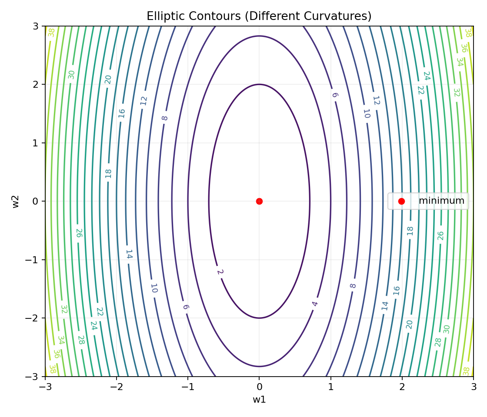
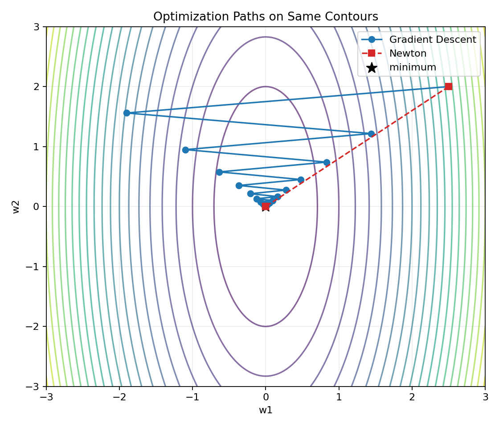
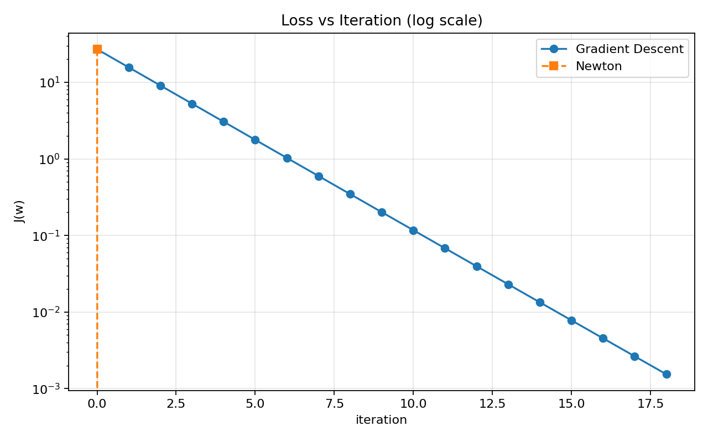

# 04. 多元泰勒、Hessian 与牛顿法直觉

> 本节配套可视化文件：`04_多元泰勒_Hessian与牛顿法直觉_可视化.ipynb`

## 1) 直觉理解

- 一阶信息（梯度）告诉你“往哪边下坡”。
- 二阶信息（Hessian）告诉你“地形弯曲程度”。
- 牛顿法利用二阶信息，自动缩放和旋转步长方向，常比普通梯度下降更快接近最优点。

一句话：**梯度是方向，Hessian 是地形曲率，牛顿法用曲率修正步子。**

---

## 2) 数学定义

### 2.1 多元二阶泰勒展开

对目标函数 $J(\mathbf{w})$，在点 $\mathbf{w}$ 附近：

$$
J(\mathbf{w}+\Delta\mathbf{w})
\approx
J(\mathbf{w}) + \nabla J(\mathbf{w})^T\Delta\mathbf{w}
+ \frac12\Delta\mathbf{w}^TH(\mathbf{w})\Delta\mathbf{w}
$$

其中：
- $\nabla J(\mathbf{w})$：梯度向量
- $H(\mathbf{w})$：Hessian 矩阵（由二阶偏导组成）

### 2.2 Hessian 矩阵

$$
H(\mathbf{w})=
\begin{bmatrix}
\frac{\partial^2 J}{\partial w_1^2} & \cdots & \frac{\partial^2 J}{\partial w_1\partial w_n}\\
\vdots & \ddots & \vdots\\
\frac{\partial^2 J}{\partial w_n\partial w_1} & \cdots & \frac{\partial^2 J}{\partial w_n^2}
\end{bmatrix}
$$

---

## 3) 牛顿法更新公式

用二阶近似最小化可得：

$$
\Delta\mathbf{w}=-H^{-1}(\mathbf{w})\nabla J(\mathbf{w})
$$

$$
\mathbf{w}_{t+1}=\mathbf{w}_t-H^{-1}(\mathbf{w}_t)\nabla J(\mathbf{w}_t)
$$

与梯度下降对比：

$$
\mathbf{w}_{t+1}=\mathbf{w}_t-\eta\nabla J(\mathbf{w}_t)
$$

区别：
- 梯度下降：固定学习率 $\eta$
- 牛顿法：用 $H^{-1}$ 自动按曲率调整（不同方向步长不同）

---

## 4) 小例子（二次函数）

设

$$
J(\mathbf{w})=\frac12\mathbf{w}^T A\mathbf{w}-\mathbf{b}^T\mathbf{w}
$$

其中 $A$ 对称正定。

则

$$
\nabla J(\mathbf{w})=A\mathbf{w}-\mathbf{b},\quad H=A
$$

牛顿一步更新：

$$
\mathbf{w}_{new}=\mathbf{w}-A^{-1}(A\mathbf{w}-\mathbf{b})=A^{-1}\mathbf{b}
$$

即直接到最优解（对标准二次函数，理想情况下 1 步到位）。

---

## 5) 图表化理解（运行 notebook 生成）

### 图1：椭圆等高线（各向异性曲率）

### 图2：梯度下降 vs 牛顿法路径对比

### 图3：收敛速度对比（损失-迭代）

---

## 6) 常见误区

1. 认为牛顿法一定比梯度下降好（高维时 Hessian 计算/求逆代价很大）。
2. 忽略 Hessian 非正定情况（可能不是下降方向）。
3. 直接硬求逆导致数值不稳定（工程上常用拟牛顿法如 BFGS/L-BFGS）。
4. 忽略线搜索或阻尼策略（防止步子过大）。

---

## 7) 本节可复述版（面试/考试）

- 多元泰勒二阶展开引入 Hessian，描述目标函数局部曲率。
- 牛顿法通过 $H^{-1}\nabla J$ 修正更新方向与步长，通常在二次问题上收敛更快。
- 但在大规模问题中，Hessian 计算和求逆代价高，常用拟牛顿法近似。

## 个人思考补充

- 牛顿法可以实现动态学习率，使得更直接更快的收敛。