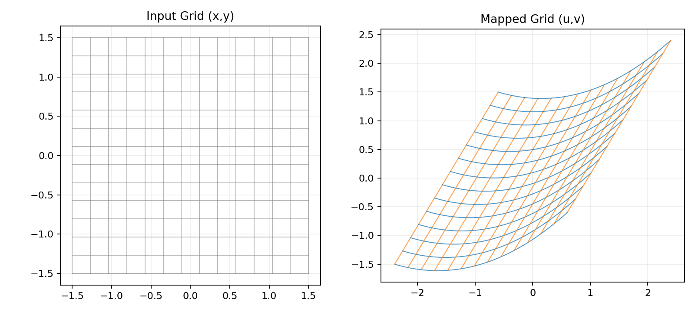
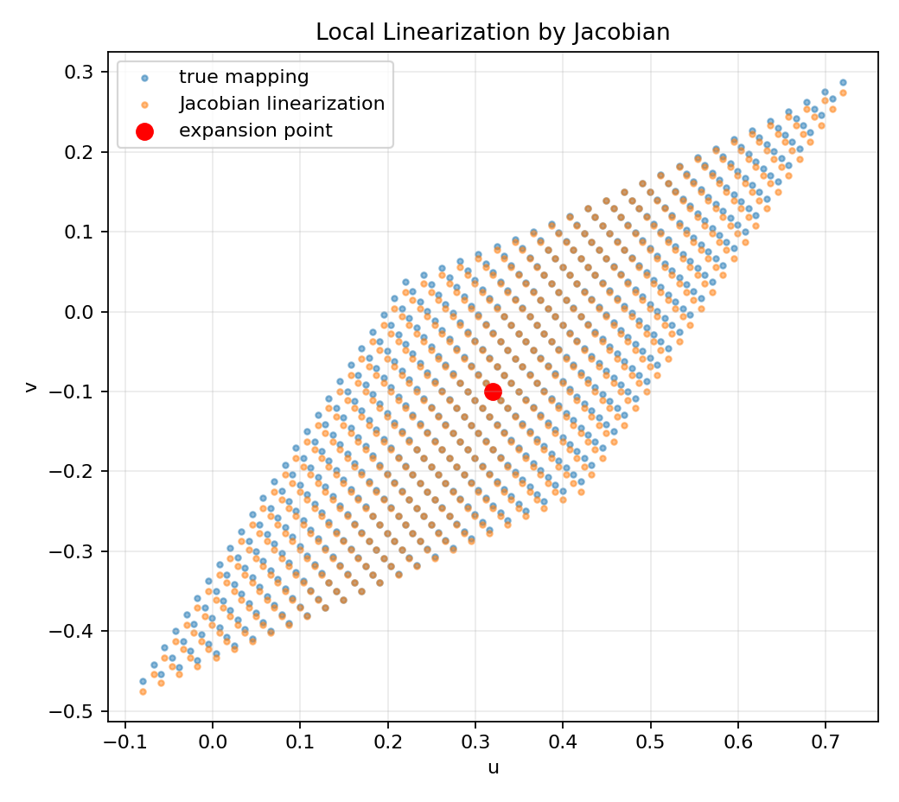
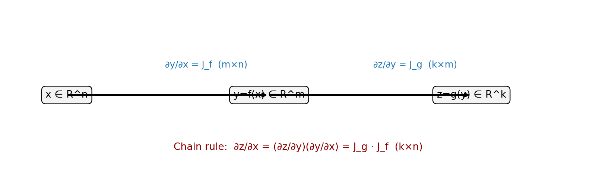

# 05. 雅可比矩阵与向量链式法则

> 本节配套可视化文件：`05_雅可比矩阵与向量链式法则_可视化.ipynb`

## 1) 直觉理解

- 标量函数对标量变量求导，结果是一个数。
- 向量函数对向量变量求导，结果就是一个“导数表”——雅可比矩阵（Jacobian）。
- 向量链式法则是反向传播在矩阵形式下的数学基础。

一句话：**雅可比矩阵是“多输入多输出函数”的导数总表。**

---

## 2) 数学定义

设向量函数

$$
\mathbf{y}=\mathbf{f}(\mathbf{x}),
\quad
\mathbf{x}\in\mathbb{R}^n,
\mathbf{y}\in\mathbb{R}^m
$$

则雅可比矩阵定义为

$$
J_{\mathbf{f}}(\mathbf{x})
=
\frac{\partial \mathbf{y}}{\partial \mathbf{x}}
=
\begin{bmatrix}
\frac{\partial y_1}{\partial x_1} & \cdots & \frac{\partial y_1}{\partial x_n}\\
\vdots & \ddots & \vdots\\
\frac{\partial y_m}{\partial x_1} & \cdots & \frac{\partial y_m}{\partial x_n}
\end{bmatrix}
\in\mathbb{R}^{m\times n}
$$

---

## 3) 向量链式法则

若

$$
\mathbf{z}=\mathbf{g}(\mathbf{y}),\quad \mathbf{y}=\mathbf{f}(\mathbf{x})
$$

则

$$
\frac{\partial \mathbf{z}}{\partial \mathbf{x}}
=
\frac{\partial \mathbf{z}}{\partial \mathbf{y}}
\cdot
\frac{\partial \mathbf{y}}{\partial \mathbf{x}}
$$

即：复合函数的雅可比 = 雅可比矩阵相乘。

---

## 4) 小例子（手算）

定义

$$
\mathbf{f}(x_1,x_2)=
\begin{bmatrix}
x_1^2 + x_2 \\
x_1x_2
\end{bmatrix}
$$

则雅可比为

$$
J_{\mathbf{f}}(x_1,x_2)=
\begin{bmatrix}
2x_1 & 1 \\
x_2 & x_1
\end{bmatrix}
$$

在点 $(x_1,x_2)=(1,2)$：

$$
J_{\mathbf{f}}(1,2)=
\begin{bmatrix}
2 & 1 \\
2 & 1
\end{bmatrix}
$$

---

## 5) 图表化理解（运行 notebook 生成）

### 图1：二维网格经过映射后的形变

### 图2：某点附近的线性近似（由雅可比给出）

### 图3：向量链式法则示意图

---

## 6) 常见误区

1. 搞错雅可比矩阵形状（应为 $m\times n$：输出维度 × 输入维度）。
2. 链式法则矩阵乘法顺序写反。
3. 把梯度向量与雅可比矩阵混为一谈。
4. 忽略维度检查导致实现错误。

---

## 7) 本节可复述版（面试/考试）

- 雅可比矩阵是向量函数对向量变量求导的矩阵形式，记录各输出对各输入的偏导。
- 向量链式法则本质是雅可比矩阵相乘，决定了深度学习中的矩阵反向传播结构。
- 正确使用的关键是：维度清晰、乘法顺序正确。

## 个人思考
雅可比矩阵是向量变量导数相乘的矩阵形式，之前的链式法则的向量版，向量版的求导的矩阵称为雅可比矩阵。