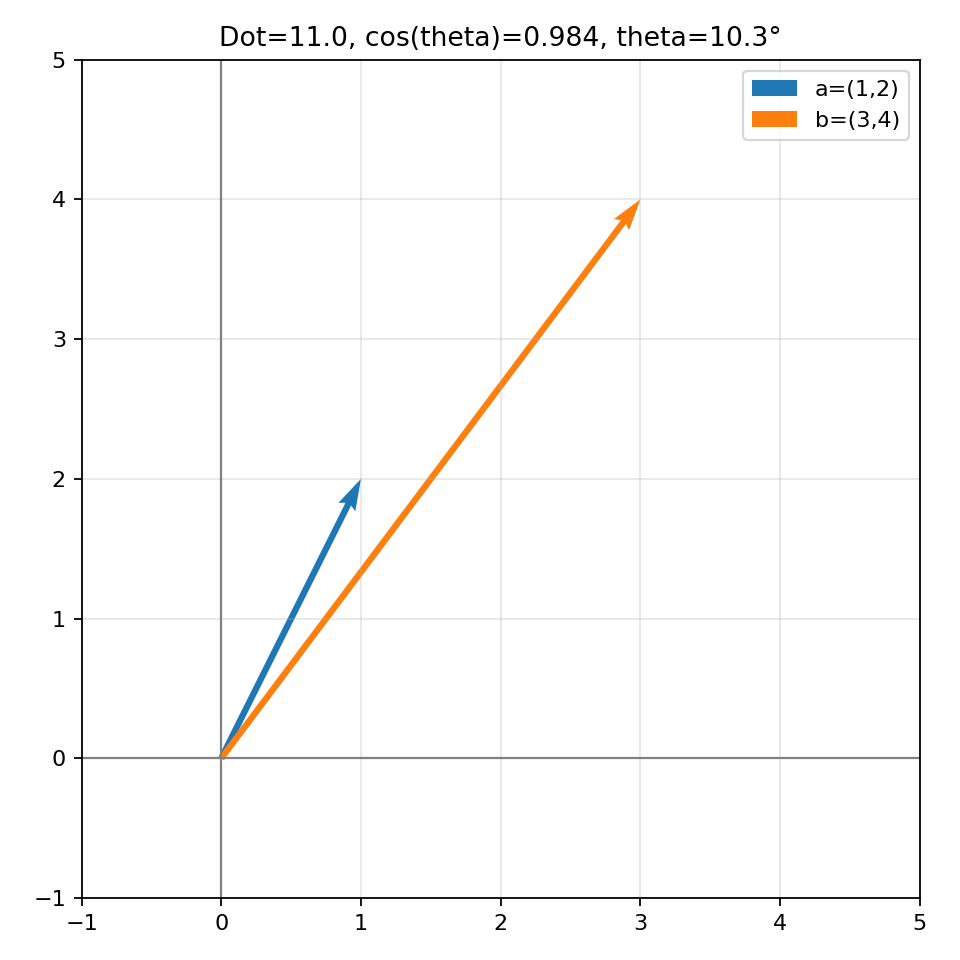
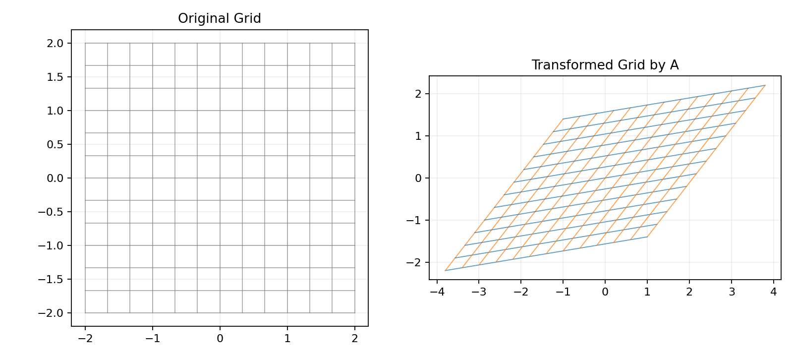
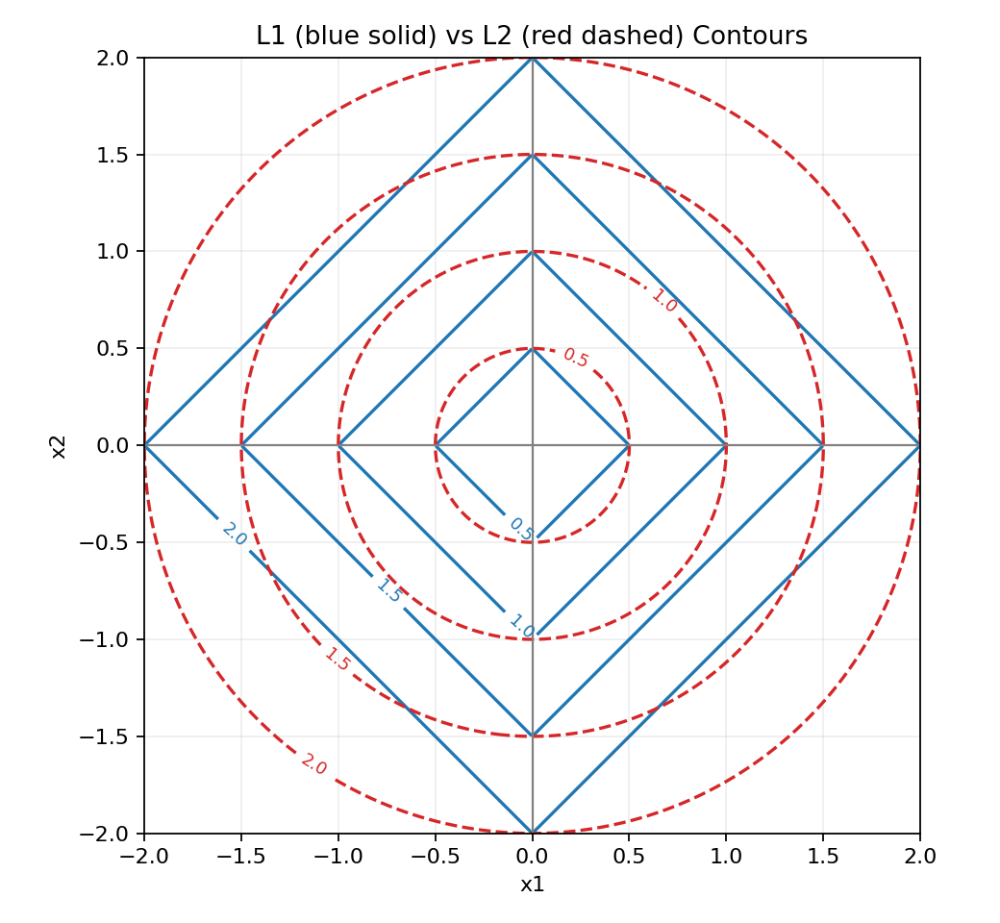

# 01. 向量、矩阵、点积、范数

> 本节配套可视化文件：`01_向量_矩阵_点积_范数_可视化.ipynb`

## 1) 直觉理解

- 向量：带方向和大小的量，也可看成一组特征。
- 矩阵：对向量做线性变换（旋转、拉伸、投影等）。
- 点积：衡量两个向量“方向一致程度”和投影关系。
- 范数：衡量向量“长度/大小”。

一句话：**线代告诉我们如何表示数据、比较相似度、做线性变换。**

---

## 2) 数学定义

### 2.1 向量与矩阵

$$
\mathbf{x}=\begin{bmatrix}x_1\\x_2\\\vdots\\x_n\end{bmatrix},
\quad
X\in\mathbb{R}^{m\times n}
$$

在机器学习中常见：
- 一条样本：$\mathbf{x}\in\mathbb{R}^n$
- 一批样本：$X\in\mathbb{R}^{m\times n}$（$m$ 条样本，$n$ 个特征）

### 2.2 点积（内积）

$$
\mathbf{a}\cdot\mathbf{b}=\sum_{i=1}^{n}a_i b_i
=\|\mathbf{a}\|\,\|\mathbf{b}\|\cos\theta
$$

意义：
- 大于 0：方向夹角小于 90°（较一致）
- 等于 0：正交（垂直）
- 小于 0：方向相反趋势较强

### 2.3 范数（常见）

$$
\|\mathbf{x}\|_1=\sum_i|x_i|,
\quad
\|\mathbf{x}\|_2=\sqrt{\sum_i x_i^2}
$$

- $L1$：稀疏相关（Lasso）
- $L2$：平滑收缩（Ridge、权重衰减）

---

## 3) 在机器学习中的作用

1. **线性模型表达**：
   $$
   \hat y=\mathbf{w}^T\mathbf{x}+b
   $$

2. **相似度计算**：点积或余弦相似度。

3. **正则化**：
   - $L1$ 与稀疏特征选择相关
   - $L2$ 抑制过大参数，提升泛化

---

## 4) 小例子

设

$$
\mathbf{a}=(1,2),\quad \mathbf{b}=(3,4)
$$

则

$$
\mathbf{a}\cdot\mathbf{b}=1\cdot3+2\cdot4=11
$$

$$
\|\mathbf{a}\|_2=\sqrt{1^2+2^2}=\sqrt{5},
\quad
\|\mathbf{b}\|_2=\sqrt{3^2+4^2}=5
$$

余弦相似度：

$$
\cos\theta=\frac{\mathbf{a}\cdot\mathbf{b}}{\|\mathbf{a}\|\|\mathbf{b}\|}=
\frac{11}{5\sqrt5}\approx0.984
$$

表示二者方向很接近。

---

## 5) 图表化理解（运行 notebook 生成）

### 图1：两个向量与夹角

### 图2：矩阵变换前后网格

### 图3：L1 与 L2 范数等值线对比

---

## 6) 常见误区

1. 把矩阵乘法当作逐元素乘法。
2. 忽略维度匹配（最常见报错来源）。
3. 误以为点积只和长度有关，忽视角度因素。
4. 记住了公式，但不知道其几何意义（投影、角度、变换）。

---

## 7) 本节可复述版（面试/考试）

- 向量是特征表示，矩阵是线性变换；点积体现方向相关性，范数衡量大小。
- 线性模型、相似度计算、正则化都依赖这些基础概念。
- 学习线代时应同时掌握代数表达和几何直觉。

---

## 8) 记住一句话

**向量是表示，矩阵是变换，点积是相似，范数是大小。**
