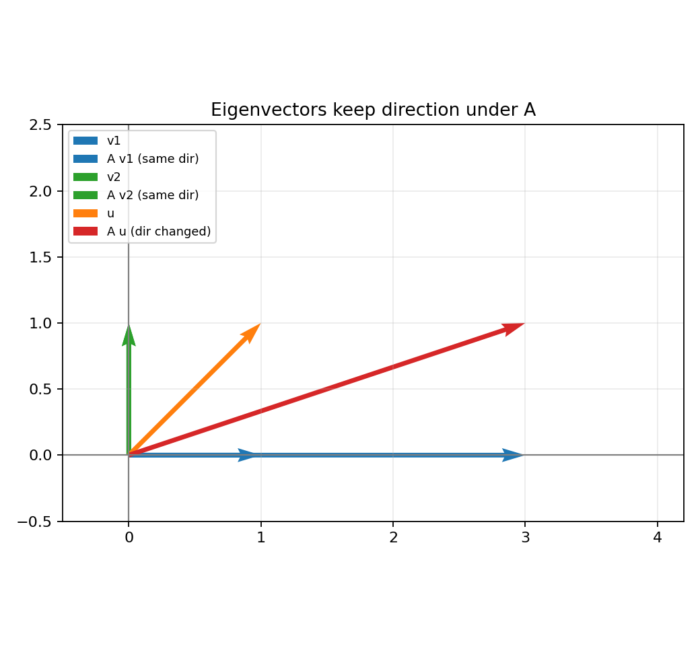
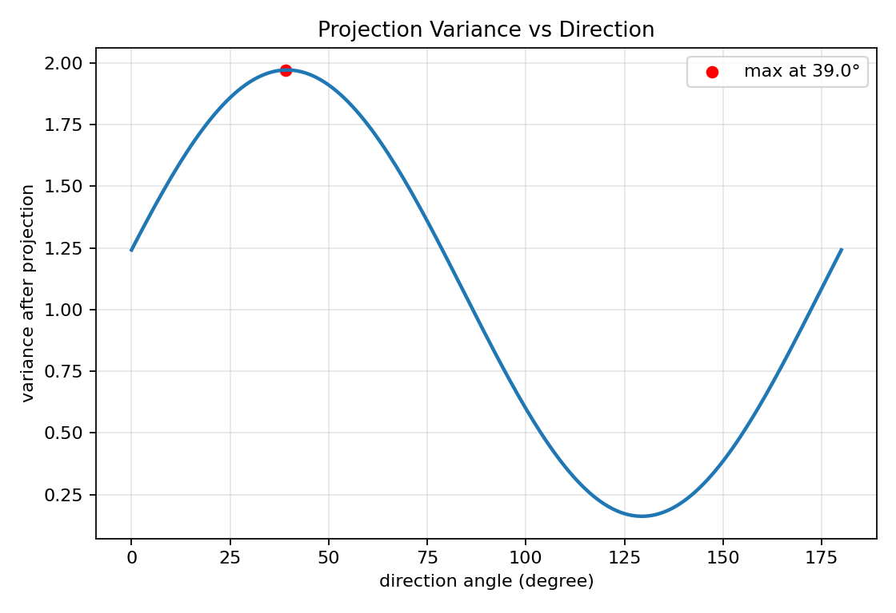
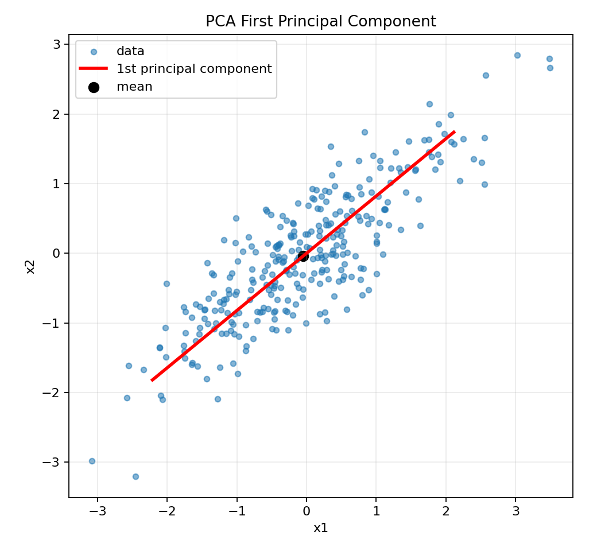

# 02. 特征值、特征向量与 PCA 直觉

> 本节配套可视化文件：`02_特征值_特征向量与PCA直觉_可视化.ipynb`

## 0) 术语与缩写对照

- PCA（Principal Component Analysis，主成分分析）

先说学习目标：
- 看到公式 $A\mathbf{v}=\lambda\mathbf{v}$ 时，能用一句话解释含义；
- 能把“特征值/特征向量”与 PCA 降维联系起来，而不是只会背定义。

## 1) 直觉理解

- 矩阵变换通常会改变向量方向和长度。
- 但有些特殊方向变换后方向不变（只缩放），这些方向就是特征向量。
- 缩放倍数就是特征值。
- PCA 利用这个思想，找到数据“方差最大”的主方向做降维。

一句话：**特征向量是变换的“稳定方向”，PCA 用它找数据主方向。**

---

## 2) 数学定义

对方阵 $A\in\mathbb{R}^{n\times n}$，若存在非零向量 $\mathbf{v}$ 和标量 $\lambda$ 使

$$
A\mathbf{v}=\lambda\mathbf{v}
$$

文字解释：
- 左边 $A\mathbf{v}$ 表示“矩阵作用在向量上”；
- 右边 $\lambda\mathbf{v}$ 表示“方向不变，只把长度放大/缩小 $\lambda$ 倍”；
- 所以特征向量是“变换下方向稳定的向量”。

则：
- $\mathbf{v}$ 是 $A$ 的特征向量
- $\lambda$ 是对应特征值

求解条件：

$$
\det(A-\lambda I)=0
$$

文字解释：这个方程叫“特征方程”。
你可以把它理解成：只有当某个 $\lambda$ 使 $A-\lambda I$ 退化（行列式为 0）时，才可能存在非零解 $\mathbf{v}$。

---

## 3) 与 PCA 的关系

给定中心化数据矩阵 $X$，协方差矩阵：

$$
\Sigma=\frac{1}{m}X^TX
$$

文字解释：
- $X$ 是中心化后的样本矩阵（每列减去均值）；
- 协方差矩阵 $\Sigma$ 描述“各特征如何一起变化”；
- PCA 的核心就是分析这个协方差矩阵的主方向。

PCA 做特征分解：

$$
\Sigma\mathbf{u}_i=\lambda_i\mathbf{u}_i,
\quad
\lambda_1\ge\lambda_2\ge\cdots
$$

文字解释：
- $\mathbf{u}_i$ 是第 $i$ 个主方向；
- $\lambda_i$ 越大，说明数据在该方向越“分散”（信息量越大）；
- 所以降维时优先保留大特征值对应方向。

含义：
- $\mathbf{u}_1$：方差最大的方向（第一主成分）
- $\lambda_i$：该方向上的方差大小

降维到 $k$ 维时，取前 $k$ 个特征向量组成投影矩阵。

再翻译成操作步骤：
1. 先中心化数据；
2. 计算协方差矩阵；
3. 做特征分解并按特征值排序；
4. 取前 $k$ 个方向投影。

---

## 4) 小例子（2×2）

设

$$
A=
\begin{bmatrix}
3 & 0 \\
0 & 1
\end{bmatrix}
$$

则：
- 对 $\mathbf{e}_1=(1,0)^T$，$A\mathbf{e}_1=(3,0)^T=3\mathbf{e}_1$，特征值 3
- 对 $\mathbf{e}_2=(0,1)^T$，$A\mathbf{e}_2=(0,1)^T=1\mathbf{e}_2$，特征值 1

说明 x 轴方向被放大 3 倍，y 轴方向不变。

这就是“稳定方向”的直观例子：
- x 轴和 y 轴都没有被旋转，只被缩放；
- 缩放倍数就是对应特征值。

---

## 5) 图表化理解（运行 notebook 生成）

### 图1：矩阵变换与特征向量方向

### 图2：不同投影方向的方差对比

### 图3：PCA 第一主成分示意

---

## 6) 常见误区

1. 认为任何矩阵都有 $n$ 个线性无关特征向量（不一定）。
2. 把“最大特征值方向”误解为“数据均值方向”。
3. 未做中心化就直接 PCA，结果会偏。
4. 把 PCA 当分类算法（PCA 本质是降维/表示学习）。

---

## 7) 本节可复述版（面试/考试）

- 特征向量是矩阵作用下方向不变的向量，特征值表示缩放倍数。
- PCA 通过协方差矩阵特征分解提取数据方差最大的主方向。
- 选取最大特征值对应特征向量可实现信息保留较多的线性降维。

---

## 8) 记住一句话

**特征向量是变换的稳定方向，特征值是该方向的缩放强度；PCA 就是找方差最大方向。**
