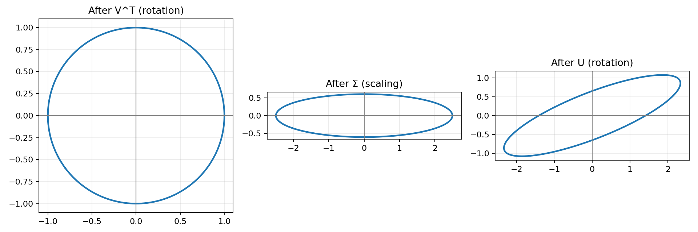
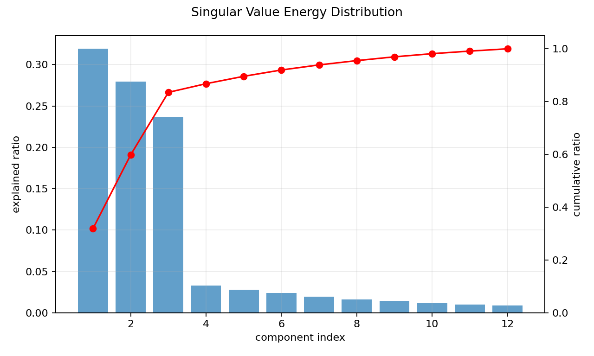
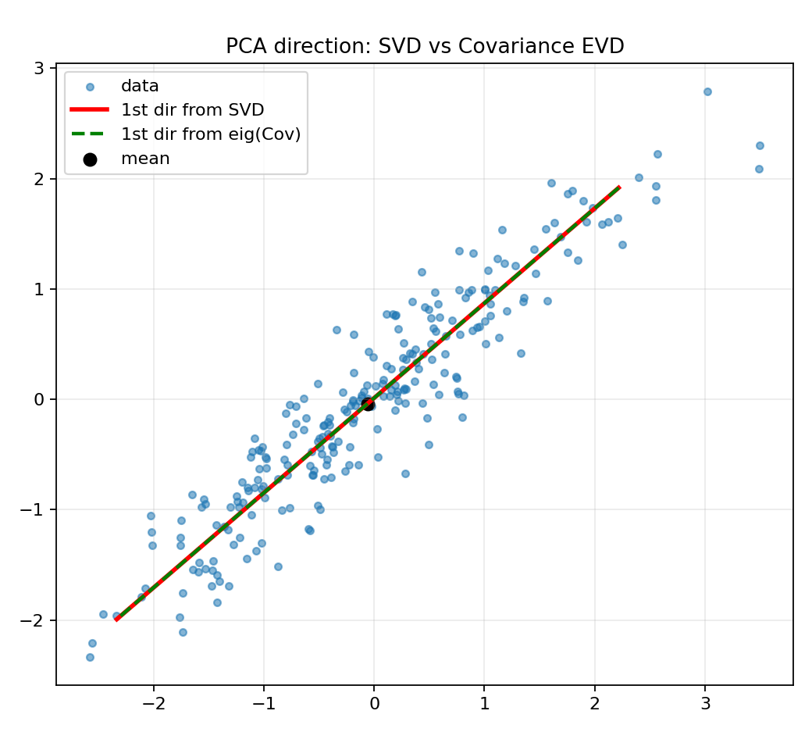

# 03. SVD 直觉与 PCA 关系

> 本节配套可视化文件：`03_SVD直觉与PCA关系_可视化.ipynb`

## 0) 术语与缩写对照

- SVD（Singular Value Decomposition，奇异值分解）
- PCA（Principal Component Analysis，主成分分析）

先说学习目标：
- 明白为什么很多库用 SVD 实现 PCA；
- 不把 SVD 当成“只会分解公式”，而是理解其几何意义与工程价值。

## 1) 直觉理解

- SVD（奇异值分解）把任意矩阵拆成“旋转 + 拉伸 + 旋转”。
- PCA 想找数据方差最大的方向；SVD 可以更稳定高效地求出这些方向。
- 所以工程里经常“用 SVD 实现 PCA”。

一句话：**SVD 是通用矩阵分解工具，PCA 是其在数据降维中的典型应用。**

---

## 2) 数学定义

对任意矩阵 $X\in\mathbb{R}^{m\times n}$，其 SVD：

$$
X = U\Sigma V^T
$$

文字解释（把公式翻成人话）：
- $V^T$：先把坐标系旋转到“更好表示数据”的方向；
- $\Sigma$：在这些方向上按不同强度拉伸/压缩；
- $U$：再旋转到输出空间。

因此常说 SVD 是“旋转 + 拉伸 + 旋转”。

其中：
- $U\in\mathbb{R}^{m\times m}$：左奇异向量（正交）
- $V\in\mathbb{R}^{n\times n}$：右奇异向量（正交）
- $\Sigma\in\mathbb{R}^{m\times n}$：对角非负奇异值

若只取前 $k$ 个奇异值/向量，可得低秩近似：

$$
X \approx U_k\Sigma_kV_k^T
$$

文字解释：只保留最重要的前 $k$ 个方向，相当于“丢掉贡献很小的细节”，达到降维/压缩目的。

---

## 3) SVD 与 PCA 的关系

对中心化数据矩阵 $X_c$：

$$
X_c = U\Sigma V^T
$$

文字解释：这里 $X_c$ 是中心化后的数据矩阵（每个特征减均值）。
PCA 的理论前提通常就是先中心化。

协方差矩阵：

$$
\Sigma_x = \frac1m X_c^TX_c
= \frac1m V\Sigma^2V^T
$$

文字解释：这个式子告诉我们：
- 协方差矩阵的特征向量，正好是 $V$ 的列向量；
- 协方差矩阵的特征值，与奇异值平方成比例。

所以只要做一次 SVD，就同时拿到了 PCA 最关心的信息。

结论：
- PCA 主方向 = $V$ 的列向量（右奇异向量）
- PCA 特征值 = $\Sigma^2/m$

因此可直接通过 SVD 得到 PCA 结果。

---

## 4) 小例子（低秩近似）

设矩阵 $X$ 做 SVD 后奇异值为：

$$
\sigma_1=10,\ \sigma_2=3,\ \sigma_3=0.2
$$

文字解释：
- 第1、第2个奇异值远大于第3个；
- 意味着数据的主要结构集中在前两个方向；
- 第3方向贡献很小，常可忽略。

说明第3个方向贡献很小，可用前2个方向近似：

$$
X \approx U_2\Sigma_2V_2^T
$$

在压缩与降维中，这能显著降维同时保留主要信息。

---

## 5) 图表化理解（运行 notebook 生成）

### 图1：SVD 的“旋转-拉伸-旋转”几何解释

### 图2：奇异值谱（能量分布）

### 图3：PCA 投影与 SVD 投影一致性示意

---

## 6) 常见误区

1. 认为 SVD 只能用于方阵（错，任意矩阵都可以）。
2. 混淆特征值分解和 SVD 的适用条件。
3. PCA 前不中心化导致方向偏移。
4. 只看降维维数，不看解释方差比例。

---

## 7) 本节可复述版（面试/考试）

- SVD 将任意矩阵分解为正交基下的主方向与缩放强度，是稳定的低秩分析工具。
- 对中心化数据，PCA 的主成分方向等价于数据矩阵 SVD 的右奇异向量。
- 因此工程实践中常用 SVD 高效实现 PCA。

---

## 8) 记住一句话

**PCA 找方向，SVD 给工具；中心化后做 SVD 就能得到 PCA 主方向。**
