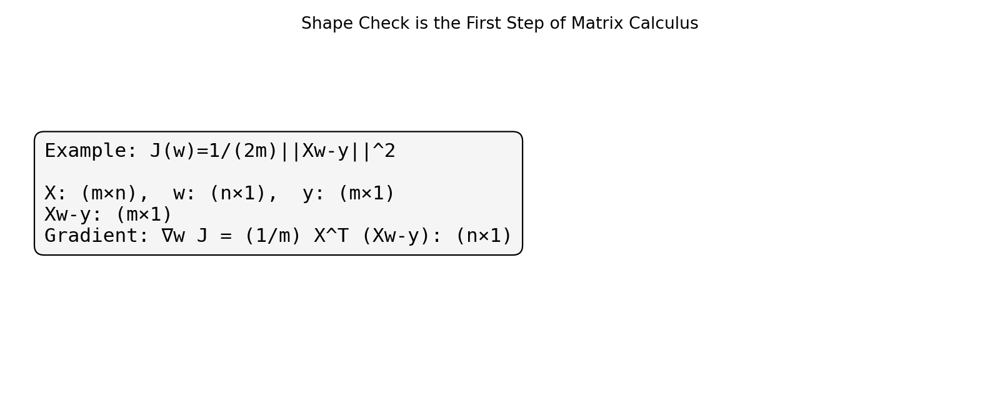
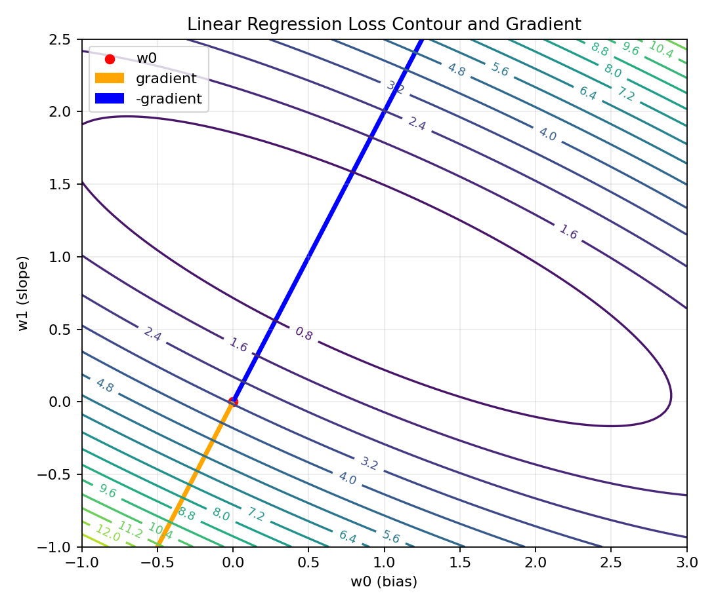
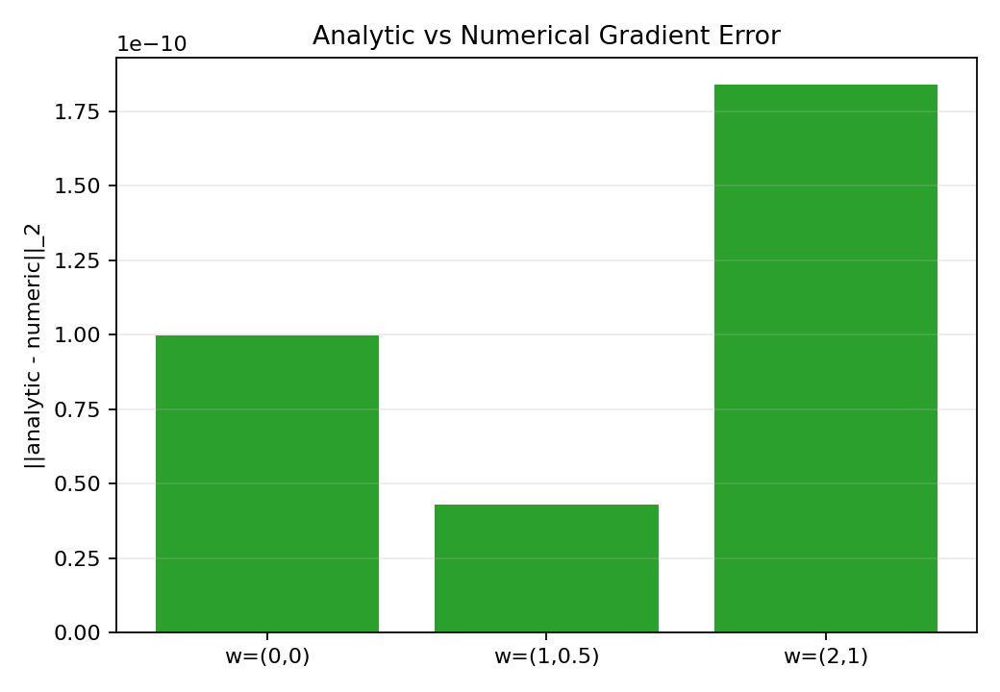

# 04. 矩阵求导入门

> 本节配套可视化文件：`04_矩阵求导入门_可视化.ipynb`

## 1) 直觉理解

- 矩阵求导本质是在回答：参数稍微变一点，损失会怎么变。
- 机器学习训练时，参数常是向量/矩阵，所以需要矩阵形式的导数。
- 你可以把矩阵求导看成“标量求导在高维空间的升级版”。

一句话：**矩阵求导的目标就是高效得到梯度，用于参数更新。**

---

## 2) 基本形状与常用结论

设 $\mathbf{x}\in\mathbb{R}^n$，$A\in\mathbb{R}^{n\times n}$，$\mathbf{a}\in\mathbb{R}^n$。

这一节先给你一个阅读原则：
- 先看“输入是什么维度，输出要什么维度”；
- 再看公式。

因为矩阵求导最容易错在“形状不对”，不是计算本身。

### 2.1 常见导数

$$
\frac{\partial (\mathbf{a}^T\mathbf{x})}{\partial \mathbf{x}}=\mathbf{a}
$$

文字解释：$\mathbf{a}^T\mathbf{x}$ 是一个标量（点积）。
对向量 $\mathbf{x}$ 求导，结果应是一个与 $\mathbf{x}$ 同维度的向量，正好就是 $\mathbf{a}$。

$$
\frac{\partial (\mathbf{x}^T A\mathbf{x})}{\partial \mathbf{x}}=(A+A^T)\mathbf{x}
$$

文字解释：$\mathbf{x}^TA\mathbf{x}$ 是二次型，常出现在损失函数里。
如果 $A$ 不是对称矩阵，需要同时考虑“左边和右边”两部分，因此出现 $A+A^T$。

若 $A$ 对称：

$$
\frac{\partial (\mathbf{x}^T A\mathbf{x})}{\partial \mathbf{x}}=2A\mathbf{x}
$$

文字解释：当 $A=A^T$ 时，上式会简化为 $2A\mathbf{x}$，这是最常见、也最常用的情况。

$$
\frac{\partial}{\partial \mathbf{x}}\frac12\|A\mathbf{x}-\mathbf{b}\|_2^2
=A^T(A\mathbf{x}-\mathbf{b})
$$

文字解释：这是“平方误差”对参数的梯度模板。
可以读成：
- 先算残差 $A\mathbf{x}-\mathbf{b}$（预测误差）；
- 再左乘 $A^T$，把误差映射回参数空间，得到更新方向。

---

## 3) 在线性回归中的应用

损失函数（MSE，Mean Squared Error，均方误差，矩阵形式）：

$$
J(\mathbf{w})=\frac{1}{2m}\|X\mathbf{w}-\mathbf{y}\|_2^2
$$

文字解释：
- $X\mathbf{w}$ 是模型预测值；
- $X\mathbf{w}-\mathbf{y}$ 是预测误差；
- 对所有样本取平方并平均（前面的 $1/(2m)$ 只是为了推导简洁）。

梯度：

$$
\nabla_{\mathbf{w}}J(\mathbf{w})=\frac{1}{m}X^T(X\mathbf{w}-\mathbf{y})
$$

文字解释：这个梯度告诉你“当前参数往哪里改，损失会下降更快”。
如果某个方向梯度很大，说明该方向的参数改动对损失影响大。

更新：

$$
\mathbf{w}\leftarrow\mathbf{w}-\eta\nabla_{\mathbf{w}}J(\mathbf{w})
$$

文字解释：
- $\eta$ 是学习率；
- 减号表示沿负梯度方向更新；
- 迭代多次后，参数通常会逐步靠近最优值。

---

## 4) 小例子（手算一轮梯度）

设

$$
X=
\begin{bmatrix}
1 & 2\\
1 & 0\\
1 & 1
\end{bmatrix},
\quad
\mathbf{y}=
\begin{bmatrix}
2\\1\\2
\end{bmatrix},
\quad
\mathbf{w}=
\begin{bmatrix}
0\\0
\end{bmatrix}
$$

文字解释：
- 这里有 3 条样本、2 个参数（第1列全是1，可理解为偏置项）；
- 初始参数设为 0，方便看清第一步如何更新。

则

$$
\nabla J(\mathbf{w})=\frac1mX^T(X\mathbf{w}-\mathbf{y})
=\frac13X^T(-\mathbf{y})
=\begin{bmatrix}-\frac53\\-2\end{bmatrix}
$$

文字解释：梯度为负，表示参数若往正方向移动，损失会下降。
这和后面更新结果（参数变成正值）一致。

若学习率 $\eta=0.1$，更新后：

$$
\mathbf{w}_{new}=\mathbf{w}-0.1\nabla J
=\begin{bmatrix}0.1667\\0.2\end{bmatrix}
$$

文字解释：一次更新后，参数从 $(0,0)$ 变为正值。
这只是第一步，真实训练会重复“前向-求梯度-更新”很多轮。

---

## 5) 图表化理解（运行 notebook 生成）

### 图1：矩阵求导常见“形状检查”

### 图2：线性回归损失等高线与梯度方向

### 图3：解析梯度 vs 数值梯度对比

---

## 6) 常见误区

1. 导数结果维度写错（最常见）。
2. 忘记转置（如 $X^T$ 漏掉）。
3. 把逐元素乘法和矩阵乘法混淆。
4. 不做数值梯度校验，导致推导错而不自知。

---

## 7) 本节可复述版（面试/考试）

- 矩阵求导是机器学习参数优化的基础，用于把损失对向量/矩阵参数的变化率写成紧凑形式。
- 在线性回归中，MSE 的梯度可写为 $\frac1mX^T(Xw-y)$，可直接用于梯度下降。
- 做矩阵求导时应优先检查维度和转置是否正确。

---

## 8) 记住一句话

**矩阵求导最关键不是背公式，而是“维度对 + 转置对 + 方向对”。**
