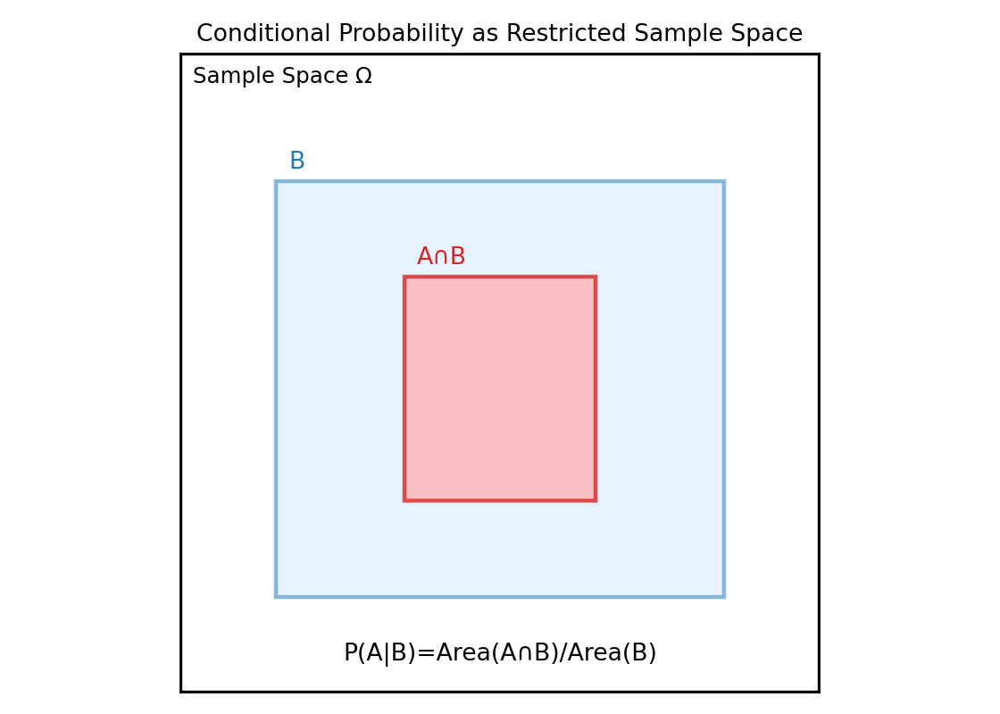
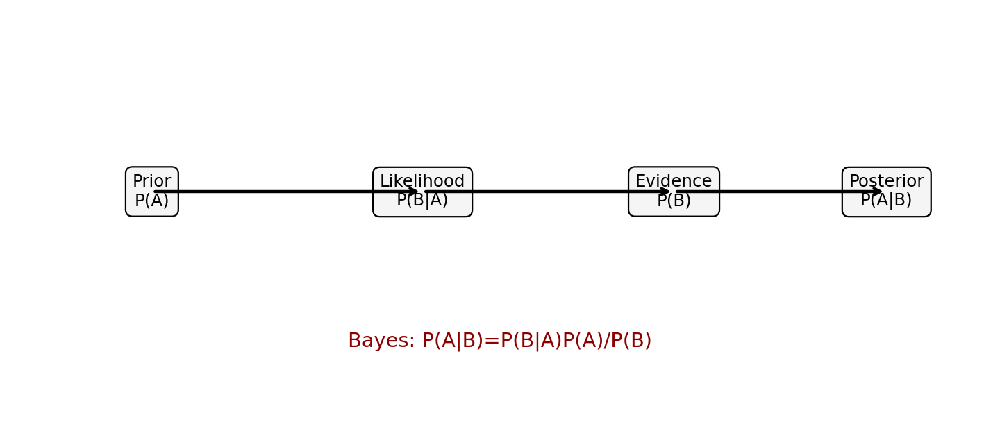
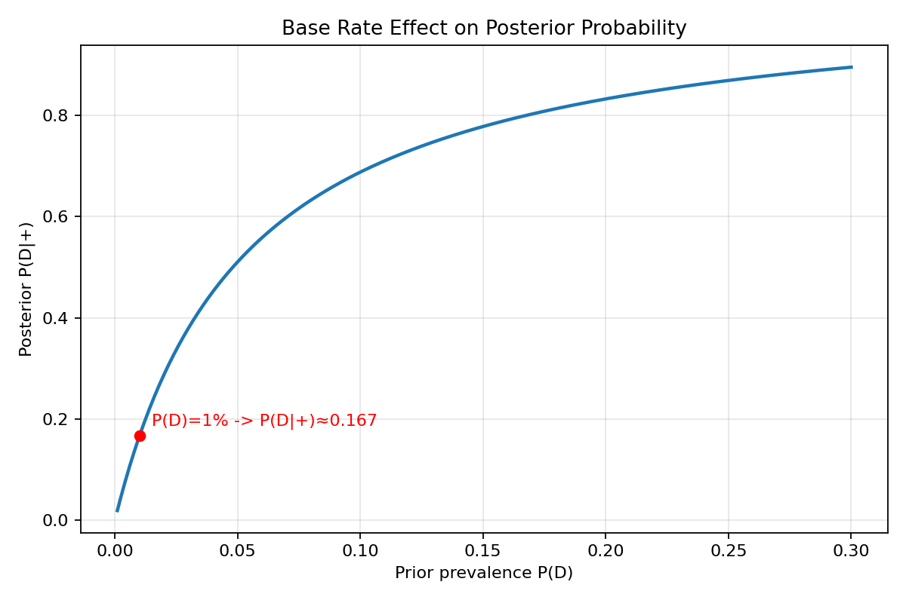

# 01. 条件概率与贝叶斯公式

> 本节配套可视化文件：`01_条件概率与贝叶斯公式_可视化.ipynb`

## 0) 术语与缩写对照

- PDF（Probability Density Function，概率密度函数）
- PMF（Probability Mass Function，概率质量函数）

本节目标：
- 先把“条件概率”理解成“在已知信息下重新计算概率”；
- 再理解贝叶斯公式如何把“先验认知 + 新证据”合并成“后验结论”。

---

## 1) 直觉理解

- 普通概率：不知道额外信息时的可能性。
- 条件概率：知道某件事已经发生后，再看另一件事的可能性。
- 贝叶斯公式：把“从原因推结果”与“从结果反推原因”连接起来。

一句话：**贝叶斯公式就是“看到证据后，更新原有判断”的数学规则。**

---

## 2) 数学定义

### 2.1 条件概率

$$
P(A|B)=\frac{P(A\cap B)}{P(B)},\quad P(B)>0
$$

文字解释：
- 分母 $P(B)$：已知事件 $B$ 发生，相当于把样本空间缩小到 $B$；
- 分子 $P(A\cap B)$：在这个缩小后的空间里，同时满足 $A$ 和 $B$ 的部分；
- 所以条件概率就是“缩小样本空间后的占比”。

### 2.2 贝叶斯公式

$$
P(A|B)=\frac{P(B|A)P(A)}{P(B)}
$$

文字解释：
- $P(A)$：先验（Prior，先验概率）——看证据前对 $A$ 的判断；
- $P(B|A)$：似然（Likelihood，似然）——若 $A$ 成立，看到证据 $B$ 的可能性；
- $P(A|B)$：后验（Posterior，后验概率）——看到证据后对 $A$ 的新判断。

---

## 3) 全概率公式（贝叶斯常配套）

若 $A_1,\dots,A_n$ 是互斥且完备事件组，则

$$
P(B)=\sum_{i=1}^{n}P(B|A_i)P(A_i)
$$

文字解释：
- 事件 $B$ 可能由多种原因 $A_i$ 导致；
- 总概率就是把每条原因路径的贡献加起来；
- 贝叶斯中常用它计算分母 $P(B)$。

---

## 4) 小例子（医学检测）

设：
- 某病患病率 $P(D)=1\%=0.01$
- 检测灵敏度 $P(+|D)=0.99$
- 误报率 $P(+|\bar D)=0.05$

求：检测阳性后真实患病概率 $P(D|+)$。

先算分母（全概率）：

$$
P(+)=P(+|D)P(D)+P(+|\bar D)P(\bar D)
=0.99\times0.01+0.05\times0.99=0.0594
$$

再用贝叶斯：

$$
P(D|+)=\frac{P(+|D)P(D)}{P(+)}
=\frac{0.99\times0.01}{0.0594}
\approx0.1667
$$

文字解释：虽然检测试剂“看起来很准”，但因基础患病率低，阳性后真实患病概率只有约 16.67%。
这就是“基准率（base rate）影响”的典型例子。

---

## 5) 图表化理解（运行 notebook 生成）

### 图1：条件概率的样本空间切分

### 图2：先验-似然-后验关系图

### 图3：不同患病率下后验概率变化

---

## 6) 常见误区

1. 把 $P(A|B)$ 和 $P(B|A)$ 当成一回事。
2. 忽略基准率，只看“检测准确率”。
3. 分母 $P(B)$ 计算不完整（漏掉某些路径）。
4. 见到后验就忘了先验的作用。

---

## 7) 本节可复述版（面试/考试）

- 条件概率是“在已知事件成立时的重新归一化概率”。
- 贝叶斯公式把先验与证据结合，得到后验概率。
- 实际判断中必须考虑基准率，否则会高估或低估风险。

---

## 8) 记住一句话

**贝叶斯不是凭空算概率，而是“先验判断 + 新证据”后的理性更新。**
